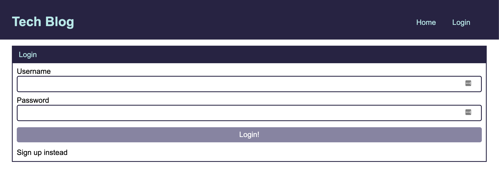
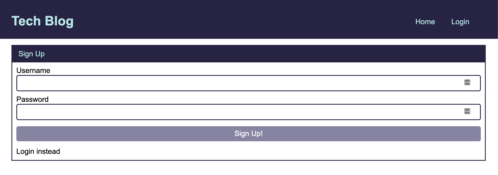
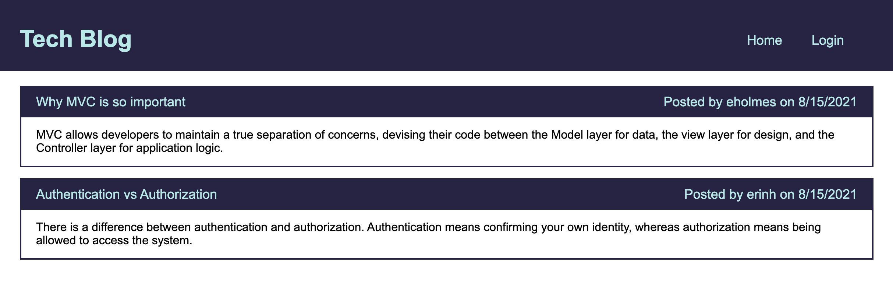
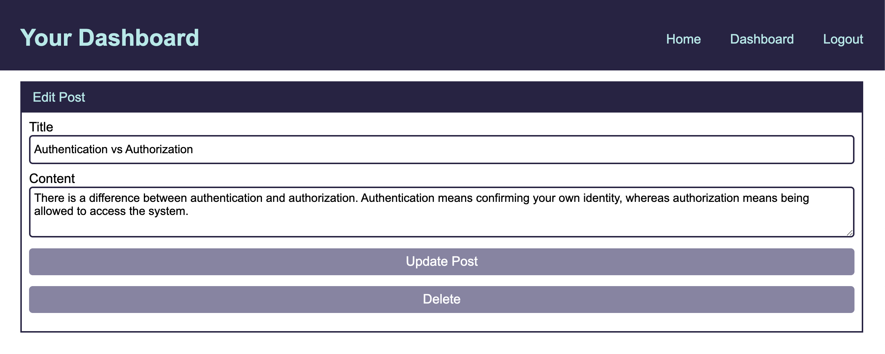

# Tech Blog
## Model-View-Controller Challenge

## Description

## Table of Contents
* [Installation](#installation)
* [Usage](#usage)
* [Questions](#questions)

## Installation
To install any necessary dependencies run the following command: 

    npm install

## Usage 
Clone the repo to your local machine and open in an IDE. Make sure you have node.js and npm installed (hint: `node -v` & `npm -v`). In the packages root directory, install the following packages: express.js, sequelize, mysql2, and dotenv (`npm i express express-handlebars express-session connect-session-sequelize sequelize mysql2 dotenv`). 

## Questions
If you have any questions or feedback, create a new issue and add the label "question". 
View more of my work: [github.com/emholmes](https://github.com/emholmes).