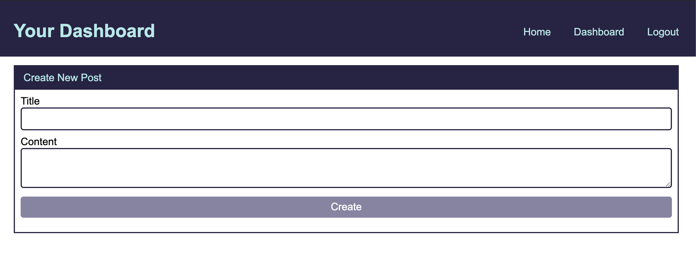
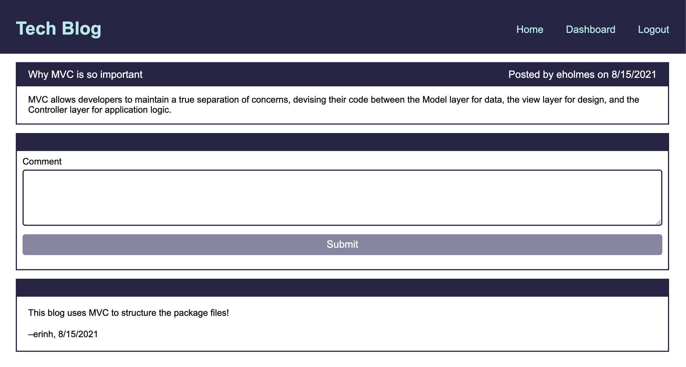

# Tech Blog
## Model-View-Controller Challenge

## Description
This week we were challenged to build a blog style website where users can publish blog posts and comment on other user's posts. The main theme this week is to follow the MVC paradigm for the app's architectural structure. A few other key packages are also introduced this week, including: Handlebars.js templating language and express-session for user authentication. Authenticated users session will expire after 30 minutes of inactivity. This app is deployed to Heroku. 
The development of this application marks a significant milestone in the bootcamp as my first solo full-stack web application.

Deployed Application (via Heroku): https://tech-blog-mvc-eh.herokuapp.com/dashboard 

## Table of Contents
* [Installation](#installation)
* [Usage](#usage)
* [Questions](#questions)

## Installation
To install any necessary dependencies run the following command: 

    npm install

## Usage 
For local usage, clone the repo to your local machine and open in an IDE. Make sure you have node.js and npm installed (hint: `node -v` & `npm -v`). In the packages root directory, install the following packages: express.js, sequelize, mysql2, and dotenv (`npm i express express-handlebars express-session connect-session-sequelize sequelize mysql2 dotenv`). To create the database run, `source db/schema.sql` within the mysql shell, and run `npm start` from the root directory to initiate the program locally. 

Login view: 

Signup view:

Homepage view:

Create New Post view: 

Dashboard view:

Blog Post view: 

Update Post view:

## Questions
If you have any questions or feedback, create a new issue and add the label "question". 
View more of my work: [github.com/emholmes](https://github.com/emholmes).
